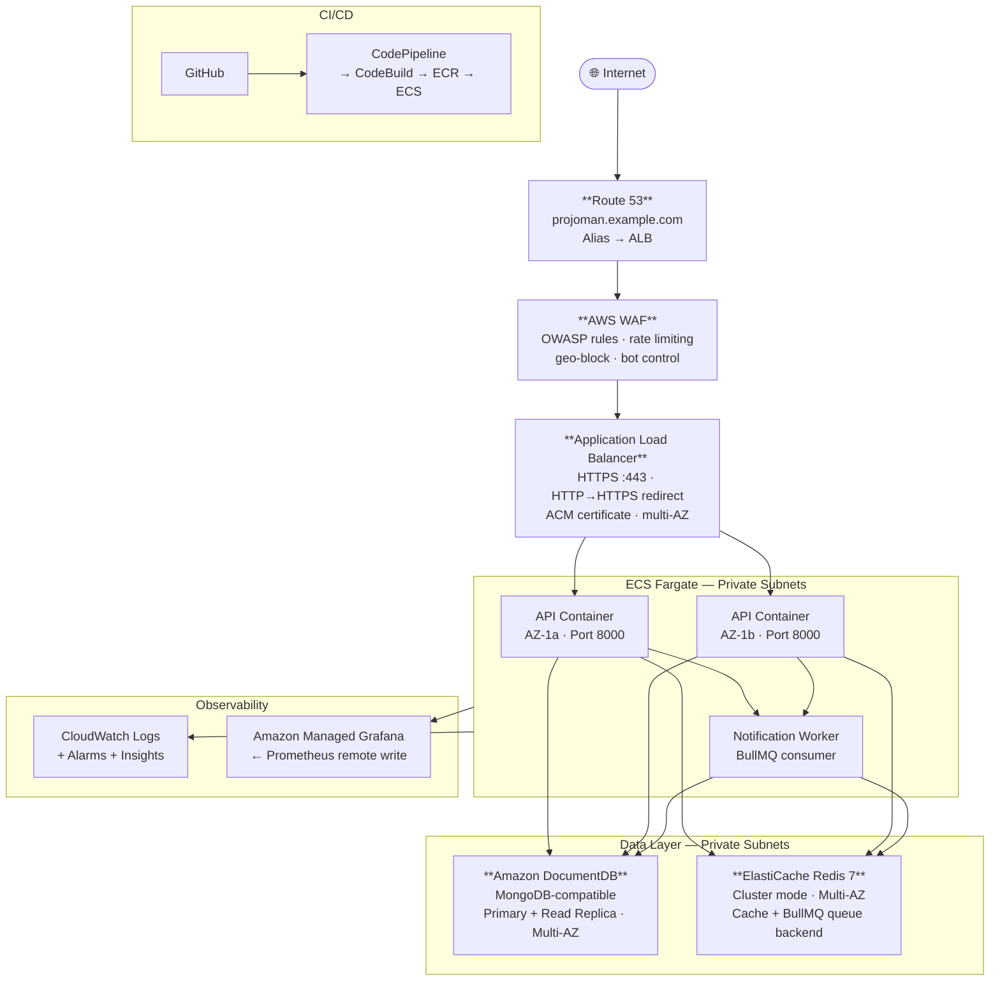
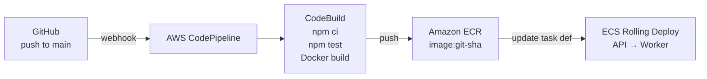

# AWS Architecture — ProjoMan Production Deployment

> Production infrastructure for the ProjoMan GraphQL API. Designed around **defence in depth**, **high availability** (multi-AZ), and **operational consistency** (managed services, immutable deployments).

---

## Table of Contents

- [Architecture Overview](#architecture-overview)
- [Traffic Flow](#traffic-flow)
- [Component Breakdown](#component-breakdown)
  - [DNS — Route 53](#dns--route-53)
  - [Edge Security — AWS WAF](#edge-security--aws-waf)
  - [Load Balancer — ALB](#load-balancer--alb)
  - [Compute — ECS Fargate](#compute--ecs-fargate)
  - [Database — DocumentDB](#database--amazon-documentdb)
  - [Cache & Queue — ElastiCache Redis](#cache--queue--amazon-elasticache-for-redis)
  - [Container Registry — ECR](#container-registry--amazon-ecr)
  - [Observability](#observability)
  - [CI/CD Pipeline](#cicd-pipeline)
- [Networking — VPC Layout](#networking--vpc-layout)
- [Security Summary](#security-summary)
- [Cost Estimation](#cost-estimation)

---

## Architecture Overview



---

## Traffic Flow

```
Internet
  └── Route 53 (DNS resolution)
        └── AWS WAF (OWASP rules, rate limiting, geo-block)
              └── ALB (TLS termination, HTTPS enforcement)
                    ├── ECS API Task — AZ-1a
                    └── ECS API Task — AZ-1b
                          ├── Amazon DocumentDB (MongoDB)
                          └── ElastiCache Redis (cache + queue)
                                └── ECS Worker Task (notification consumer)
```

---

## Component Breakdown

### DNS — Route 53

- Hosted zone for `projoman.example.com`
- **Alias record** pointing to the ALB — health-aware, no TTL cost
- Automatic failover if the ALB becomes unhealthy
- Latency-based routing available if multi-region is introduced later

> [!TIP]
> When a React frontend is added, split at the DNS level: `api.projoman.com` → ALB, `app.projoman.com` → CloudFront + S3. The ALB never serves static assets.

---

### Edge Security — AWS WAF

Attached to the ALB. Rules applied in priority order:

| Priority | Rule | Purpose |
|:---:|---|---|
| 1 | AWS Managed — Core Rule Set (CRS) | OWASP Top 10: SQLi, XSS, RFI |
| 2 | AWS Managed — Known Bad Inputs | Log4j, Spring4Shell, etc. |
| 3 | Rate-based — 1 000 req / 5 min per IP | API abuse + brute force |
| 4 | Custom — block GraphQL introspection in prod | Reduces schema exposure |
| 5 | Geo-block *(optional)* | Restrict to operating regions |

WAF logs stream to CloudWatch Logs for audit and tuning.

> [!NOTE]
> WAF is attached to the ALB rather than CloudFront because this is a GraphQL API — all traffic is `POST /graphql`. CloudFront adds marginal benefit here while adding cost and complexity. If a CDN is needed for the frontend, CloudFront with WAF sits in front of S3, not this ALB.

---

### Load Balancer — ALB

**Why ALB over NLB?**

| Feature | ALB | NLB |
|---|:---:|:---:|
| Layer | 7 (HTTP/HTTPS) | 4 (TCP/UDP) |
| WAF integration | ✅ | ❌ |
| Path-based routing | ✅ | ❌ |
| WebSocket support | ✅ | ✅ |
| TLS termination | ✅ | ✅ |

ALB is correct here because all traffic is HTTP/HTTPS, WAF requires ALB, and ALB supports WebSocket upgrades for when GraphQL Subscriptions are added.

**Configuration:**

| Setting | Value |
|---|---|
| HTTPS listener | `:443` → ECS target group |
| HTTP listener | `:80` → 301 redirect to HTTPS |
| TLS certificate | AWS Certificate Manager (auto-renewed) |
| Idle timeout | 60 s (extend when subscriptions added) |
| Access logs | S3 bucket, 90-day retention |

---

### Compute — ECS Fargate

No instance management, no patching, no capacity planning. A new Docker image = a new task; old tasks drain gracefully.

**Services:**

| Service | Tasks | vCPU | Memory | Subnet |
|---|:---:|:---:|:---:|:---:|
| `api` (Apollo Server) | 2 – 10 | 0.5 | 1 GB | Private |
| `notification-worker` | 1 – 3 | 0.25 | 512 MB | Private |

**Auto Scaling:**

| Service | Metric | Scale-out threshold |
|---|---|---|
| API | ALB `RequestCountPerTarget` | 500 req / min per task |
| Worker | BullMQ queue depth (custom CloudWatch metric) | Step scaling |

**Networking:**
- Tasks run in **private subnets** — no public IP
- Outbound internet via **NAT Gateway** (one per AZ)
- Only the ALB security group can reach the API containers

**Secrets — never baked into images:**

Credentials are stored in **AWS Secrets Manager** and injected as environment variables at task launch.

| Secret | Used by |
|---|---|
| `MONGO_URI` | API + Worker |
| `SECRET_KEY` | API (JWT signing) |
| Redis AUTH token | API + Worker |

**Task IAM Role (least-privilege):**
```
secretsmanager:GetSecretValue
logs:CreateLogStream
logs:PutLogEvents
xray:PutTraceSegments  ← when tracing is added
```

---

### Database — Amazon DocumentDB

MongoDB-compatible managed database. No patching, automated backups, automatic failover.

**Cluster:**

| Instance | Role | AZ |
|---|---|---|
| `db.r6g.large` | Primary (reads + writes) | AZ-1a |
| `db.r6g.large` | Read replica (failover target) | AZ-1b |

- Automated daily snapshots — 7-day retention
- Encryption at rest (AES-256) + in transit (TLS enforced)
- Storage auto-scales up to 64 TB
- Automatic primary failover in < 30 seconds

> [!WARNING]
> DocumentDB is **not** 100% MongoDB-compatible. Some aggregation pipeline operators and change stream behaviour differ. Test all Mongoose `populate()` calls and aggregations against a real DocumentDB instance before going live.

---

### Cache & Queue — Amazon ElastiCache for Redis

One cluster serves two purposes:

| Purpose | Key pattern | TTL |
|---|---|---|
| Application cache (`cache.get/set`) | `entity:{id}`, `entity:all` | 5 min |
| BullMQ notification queue | `bull:notifications:*` | Job-controlled |

Keys are namespaced and do not collide.

**Configuration:**

| Setting | Value |
|---|---|
| Version | Redis 7 |
| Mode | Cluster mode enabled |
| Topology | 3 shards × 2 nodes (primary + replica) |
| Multi-AZ | Enabled with automatic failover |
| Encryption | In transit (TLS) + at rest |
| AUTH token | Stored in Secrets Manager |

---

### Container Registry — Amazon ECR

| Setting | Value |
|---|---|
| Repositories | `projoman/api`, `projoman/worker` |
| Image tagging | Git SHA (enables precise rollback) |
| Vulnerability scanning | On push (blocks deploy on critical CVEs) |
| Lifecycle policy | Keep last 10 tagged images; delete untagged after 1 day |

---

### Observability

#### Logs — CloudWatch Logs

ECS tasks use the `awslogs` log driver — Pino JSON stdout is captured automatically.

| Log group | Retention |
|---|---|
| `/projoman/api` | 30 days (prod), 7 days (staging) |
| `/projoman/worker` | 30 days (prod), 7 days (staging) |

- **CloudWatch Logs Insights** — query `audit:true` entries for compliance review
- **Metric filter** on `level:"error"` → CloudWatch Alarm → SNS → email / PagerDuty

#### Metrics — Prometheus + Amazon Managed Grafana

The app exposes Prometheus metrics at `:9090/metrics`. A Prometheus sidecar scrapes and remote-writes to **Amazon Managed Service for Prometheus (AMP)**. **Amazon Managed Grafana** connects to AMP and CloudWatch as data sources.

**Dashboards:**
- GraphQL operation rates, durations, error rates
- Cache hit ratio
- BullMQ queue depth
- ECS task CPU / memory
- DocumentDB connections + CPU
- ALB request count + 5xx rate

#### Alarms

| Alarm | Threshold | Action |
|---|---|---|
| API 5xx error rate | > 1% over 5 min | SNS → PagerDuty |
| ECS task count < desired | Any | SNS → on-call |
| DocumentDB CPU | > 80% for 10 min | SNS → engineering |
| ElastiCache evictions | > 100 / min | SNS → review TTL / memory |
| ALB unhealthy host count | > 0 | SNS → on-call |

---

### CI/CD Pipeline



| Stage | Steps |
|---|---|
| **Source** | GitHub webhook triggers pipeline |
| **Build** | `npm ci` → `npm test` (all 7 Jest suites must pass) → Docker multi-stage build |
| **Push** | Image tagged with Git SHA pushed to ECR |
| **Deploy** | ECS rolling update — API first (min 50% healthy), then Worker |

**Rollback:** one-click to any previous ECR image tag. A failed health check during rolling deploy automatically halts and reverts.

---

## Networking — VPC Layout

```
VPC: 10.0.0.0/16
─────────────────────────────────────────────────────────────────
              AZ-1a (ap-southeast-2a)    AZ-1b (ap-southeast-2b)
─────────────────────────────────────────────────────────────────
Public        10.0.1.0/24               10.0.2.0/24
              ALB node                  ALB node
              NAT Gateway               NAT Gateway

Private App   10.0.11.0/24              10.0.12.0/24
              ECS API tasks             ECS API tasks
              ECS Worker tasks          ECS Worker tasks

Private Data  10.0.21.0/24              10.0.22.0/24
              DocumentDB primary        DocumentDB replica
              ElastiCache primary       ElastiCache replica
─────────────────────────────────────────────────────────────────
```

**Security Groups:**

| Security Group | Inbound | Outbound |
|---|---|---|
| `sg-alb` | `0.0.0.0/0` :443, :80 | `sg-api` :8000 |
| `sg-api` | `sg-alb` :8000 | `sg-db` :27017, `sg-redis` :6379, :443 (Secrets Manager) |
| `sg-db` | `sg-api` :27017 | — |
| `sg-redis` | `sg-api` :6379 | — |

> [!IMPORTANT]
> No security group allows unrestricted `0.0.0.0/0` outbound. Databases have zero public access — they are only reachable from the API security group.

---

## Security Summary

| Control | Implementation |
|---|---|
| Network perimeter | Public subnets host only ALB + NAT — all compute and data in private subnets |
| Edge protection | WAF (managed rules + rate limiting) in front of ALB |
| Transport encryption | TLS everywhere — ALB (ACM), DocumentDB, ElastiCache |
| Secrets management | AWS Secrets Manager — no credentials in env files or images |
| IAM least privilege | Task roles with only required permissions; no wildcard `*` actions |
| Container security | ECR image scanning on push; read-only root filesystem in task definition |
| Data encryption at rest | DocumentDB + ElastiCache both AES-256 |
| Audit trail | CloudWatch Logs with `audit:true` structured entries from application |
| Introspection disabled | Apollo `introspection: false` in production + WAF rule |
| Account lockout | Application-level: 5 failures → 1-hour lockout |

---

## Cost Estimation

> Region: `ap-southeast-2` (Sydney) at moderate load

| Service | Configuration | Approx / month |
|---|---|:---:|
| ECS Fargate — API | 2 tasks × 0.5 vCPU × 1 GB | ~$30 |
| ECS Fargate — Worker | 1 task × 0.25 vCPU × 512 MB | ~$7 |
| Amazon DocumentDB | 1× `db.r6g.large` + 1 replica | ~$200 |
| ElastiCache Redis | 3 shards × `cache.r7g.small` | ~$120 |
| Application Load Balancer | 1 ALB + LCU usage | ~$25 |
| NAT Gateway | 2× NAT + data transfer | ~$65 |
| Amazon ECR | Storage + transfer | ~$5 |
| CloudWatch | Logs + metrics + alarms | ~$20 |
| AWS WAF | 1 WebACL + managed rule groups | ~$10 |
| **Total** | | **~$480 / month** |

> [!TIP]
> For early-stage or staging environments, swap to single-AZ `db.t3.medium` DocumentDB and `cache.t3.micro` Redis to bring the total down to **~$150 / month**.
