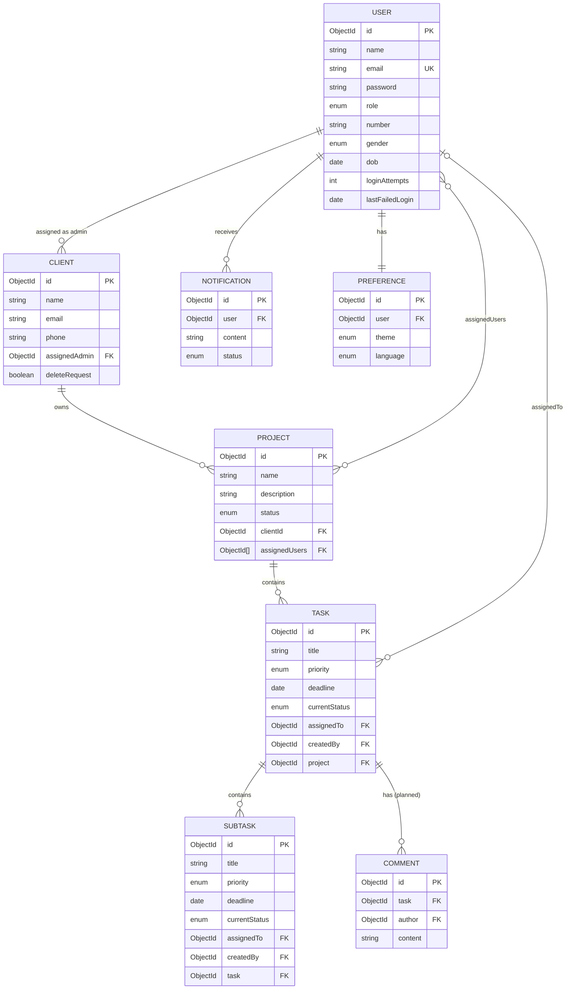
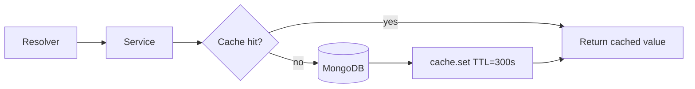
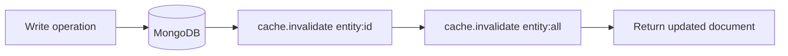
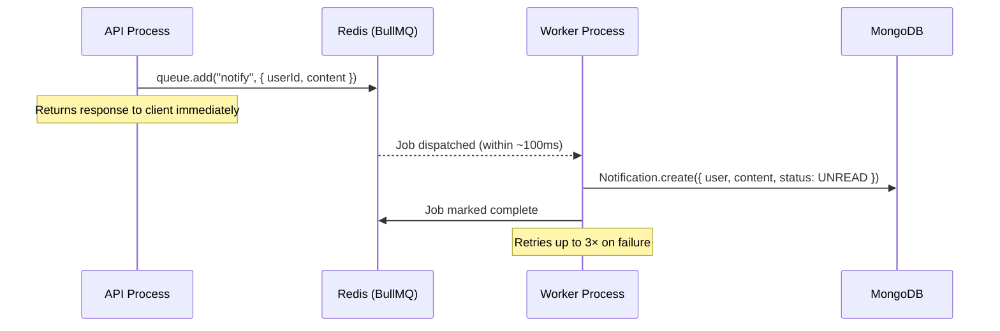

# System Design — ProjoMan Project Management API

> A deep-dive into the data model, capacity planning, architectural decisions, and scalability analysis for the ProjoMan GraphQL backend. Written in the style of a production system design review.

---

## Table of Contents

- [1. Requirements](#1-requirements)
- [2. Capacity Estimation](#2-capacity-estimation)
- [3. Data Model](#3-data-model)
- [4. API Design](#4-api-design)
- [5. Caching Strategy](#5-caching-strategy)
- [6. Async Processing](#6-async-processing)
- [7. Database Design & Indexing](#7-database-design--indexing)
- [8. Scalability Analysis](#8-scalability-analysis)
- [9. Failure Scenarios & Resilience](#9-failure-scenarios--resilience)
- [10. Observability Design](#10-observability-design)
- [11. Architectural Decision Records](#11-architectural-decision-records)

---

## 1. Requirements

### Functional Requirements

| # | Requirement |
|---|---|
| F1 | Users register, log in, and receive a JWT valid for 1 hour |
| F2 | Three roles: `SUPER_ADMIN`, `CLIENT_ADMIN`, `USER` — each with distinct access scopes |
| F3 | SUPER_ADMIN manages all clients, users, and projects |
| F4 | CLIENT_ADMIN manages their assigned client and its projects/tasks |
| F5 | USER can view their assigned projects and update tasks assigned to them |
| F6 | Tasks and subtasks have status, priority, deadline, and assignee |
| F7 | Notifications are delivered asynchronously when task-related events occur |
| F8 | Users have persistent preferences (theme, language) |
| F9 | All create/update/delete operations produce a structured audit log entry |

### Non-Functional Requirements

| # | Requirement | Target |
|---|---|---|
| NF1 | API response time (p95) | < 200 ms |
| NF2 | Availability | 99.9% (< 8.7 hours downtime/year) |
| NF3 | Read throughput | 500 req/s sustained |
| NF4 | Write throughput | 50 req/s sustained |
| NF5 | Notification delivery lag | < 5 seconds from event to DB write |
| NF6 | Failed login lockout | 5 attempts → 1-hour lockout |
| NF7 | Data durability | Zero tolerance — all writes persisted before response |

---

## 2. Capacity Estimation

### Scale Assumptions

| Entity | Count | Growth / year |
|---|---|---|
| Users | 10 000 | +3 000 |
| Clients | 500 | +100 |
| Projects | 2 000 | +500 |
| Tasks | 20 000 | +8 000 |
| SubTasks | 50 000 | +20 000 |
| Notifications | 200 000 total | +100 000 |

### Traffic Estimates

```
Daily Active Users (DAU): 10% of 10 000 = 1 000 users/day

Average session:
  - Read requests per session:  50  (browse projects, tasks, notifications)
  - Write requests per session:   5  (create task, update status, comment)
  - Requests per session:        55

Daily request volume:
  Reads:  1 000 DAU × 50 = 50 000 read requests/day
  Writes: 1 000 DAU × 5  =  5 000 write requests/day
  Total:                   55 000 requests/day

Average QPS:
  55 000 / 86 400 seconds ≈ 0.64 QPS average

Peak QPS (10× average, business hours):
  Reads:  ~6 QPS
  Writes: ~0.6 QPS
  Total:  ~7 QPS peak
```

> [!NOTE]
> At this scale, a single ECS Fargate task running Node.js can comfortably handle peak traffic. The multi-task configuration (min 2 tasks) exists for **availability**, not performance — one task per AZ ensures a single AZ failure doesn't take down the API.

### Storage Estimates

#### Per-document size

| Collection | Fields | Estimated size |
|---|---|:---:|
| User | id, name, email, password hash, role, phone, gender, dob, loginAttempts, lastFailedLogin, timestamps | ~600 B |
| Client | id, name, email, phone, assignedAdmin, deleteRequest, timestamps | ~350 B |
| Project | id, name, description, status, clientId, assignedUsers[], timestamps | ~700 B |
| Task | id, title, priority, deadline, currentStatus, assignedTo, createdBy, project, timestamps | ~500 B |
| SubTask | id, title, priority, deadline, currentStatus, assignedTo, createdBy, task, timestamps | ~480 B |
| Notification | id, user, content, status, timestamps | ~250 B |
| Preference | id, user, theme, language, timestamps | ~150 B |

#### Total storage at current scale

```
Users:         10 000 ×   600 B =   6.0 MB
Clients:          500 ×   350 B =   0.2 MB
Projects:       2 000 ×   700 B =   1.4 MB
Tasks:         20 000 ×   500 B =  10.0 MB
SubTasks:      50 000 ×   480 B =  24.0 MB
Notifications: 200 000 ×  250 B =  50.0 MB
Preferences:   10 000 ×   150 B =   1.5 MB

Raw data total:                   93.1 MB
Index overhead (~30%):            27.9 MB
MongoDB internal overhead (~10%):  9.3 MB

─────────────────────────────────────────
Estimated total DB storage:      ~130 MB
─────────────────────────────────────────

3-year projected growth:
  Data:     93.1 MB + (3 × ~40 MB) = ~213 MB
  With overhead:                     ~310 MB
```

> [!NOTE]
> At ~310 MB over 3 years, storage cost is negligible. DocumentDB `r6g.large` provides 64 TB auto-scaling storage — storage is not a constraint here at any realistic scale for this domain.

### Bandwidth Estimates

```
Average GraphQL response payload:  5 KB  (project list with tasks)
Average GraphQL request payload:   1 KB  (query + variables)

Daily outbound:  55 000 × 5 KB =  275 MB/day  ≈  9 GB/month
Daily inbound:   55 000 × 1 KB =   55 MB/day  ≈  1.7 GB/month

Peak bandwidth (7 QPS × 5 KB):    35 KB/s outbound — well within ALB limits
```

### Redis Memory Estimate

```
Cache entries (entity:{id} + entity:all per collection):
  ~500 unique cache keys
  Average cached value:  3 KB  (serialised JSON array or document)
  Cache footprint:       500 × 3 KB = 1.5 MB

BullMQ queue (notifications):
  Peak queue depth:      ~100 jobs
  Job payload:           ~500 B
  Queue footprint:       100 × 500 B = 50 KB

Total Redis working set:  ~2 MB

─────────────────────────────────────────────────────────────────
Even a cache.t3.micro (512 MB memory) is 250× larger than needed.
The r7g.small in the production spec is capacity for future growth.
─────────────────────────────────────────────────────────────────
```

---

## 3. Data Model

### Entity Relationship Diagram



### Schema Reference

#### User
| Field | Type | Constraint | Index |
|---|---|---|:---:|
| `email` | String | unique, lowercase | ✅ unique |
| `password` | String | bcrypt cost factor 10 | — |
| `role` | Enum | `SUPER_ADMIN` \| `CLIENT_ADMIN` \| `USER` | — |
| `loginAttempts` | Number | default 0 | — |
| `lastFailedLogin` | Date | null until first failure | — |

**Login lockout logic:** After 5 failed attempts, any further attempt checks `Date.now() - lastFailedLogin < 3 600 000 ms`. The window resets on successful login by zeroing both fields.

#### Project
| Field | Type | Notes |
|---|---|---|
| `assignedUsers` | `[ObjectId]` | Array of user refs. Filtered in service layer for `USER` role access. |
| `status` | Enum | `NOT_STARTED` \| `IN_PROGRESS` \| `COMPLETED` |

> [!IMPORTANT]
> The field is `assignedUsers` (plural) on the Mongoose model and in all services. The GraphQL type exposes this array under the field name `user` (for backwards compatibility). Never use `assignedUser` (singular) — it will be `undefined` at runtime.

#### Notification
| Field | Type | Notes |
|---|---|---|
| `status` | Enum | `UNREAD` (default) \| `READ` |
| `content` | String | Free text — currently plain string, candidate for structured payload in future |

#### Comment *(model defined — service/resolver not yet integrated)*
Exists in `models/Comment.js`. Planned to attach to Tasks or SubTasks.

---

## 4. API Design

### Single GraphQL Endpoint

All operations go through `POST /graphql`. No REST routes exist.

**Why GraphQL over REST for this domain:**

| Concern | REST approach | GraphQL approach |
|---|---|---|
| Nested data (project + tasks + assignees) | 3+ round trips or over-fetched `?include=` | Single query, client specifies shape |
| Auth middleware | Per-route or global middleware | Single context function, applied once |
| Error shape | Varies by framework | Consistent `extensions.code` + `extensions.statusCode` |
| Schema introspection | OpenAPI spec (manual) | Auto-generated, disabled in prod |

### Query Safety Limits

| Limit | Value | Protects against |
|---|:---:|---|
| Query depth | 7 | Deeply nested query abuse (`project.tasks.subtasks.task.project...`) |
| Query complexity | 1 000 | Expensive field fan-out (e.g. all projects × all tasks × all users) |
| Rate limit (app) | 100 req / 15 min per IP | API scraping, brute force on public ops |
| Rate limit (WAF) | 1 000 req / 5 min per IP | DDoS, volumetric abuse |

### Public vs Protected Operations

```
Public (no JWT required):
  LoginMutation · RegisterMutation · ForgotPasswordMutation · ResetPasswordMutation

Protected (Bearer token required — all others):
  All queries and mutations not in the above list
```

JWT payload: `{ id, email, role }` — signed with `SECRET_KEY` (min 32 chars), expires in 1 hour.

---

## 5. Caching Strategy

### Read Path



### Write Path (always invalidates)



### Key Convention

| Pattern | Example | When invalidated |
|---|---|---|
| `entity:all` | `clients:all` | Any create, update, or delete in that collection |
| `entity:{id}` | `clients:648a...` | Update or delete of that specific document |

### Cache TTL Analysis

```
TTL = 300 seconds (5 minutes)

For a 1 000 DAU workload with 50 reads/session distributed across an 8-hour workday:

  Read rate per entity:  ~6 reads/minute for popular entities (e.g. project list)
  Expected cache hits:   Every read after the first within a 5-min window is a hit

  Estimated cache hit rate:  ~65–70% of all read requests
  DB reads avoided per day:  50 000 × 0.65 = 32 500 saved DB round trips/day

  Each saved round trip:  ~10–30 ms MongoDB query time
  Total latency saved:    32 500 × 20 ms avg = 650 seconds of query time/day
```

### Graceful Degradation

`cache.get()` and `cache.set()` catch all Redis errors internally and log a warning. A Redis outage results in a **cache miss on every request** — the API stays up, reads fall through to MongoDB, and latency increases but correctness is maintained.

---

## 6. Async Processing

### Notification Flow



**Why async?**
A synchronous DB write for every notification adds 10–30 ms to every task-assignment response. At 50 writes/day this is unnoticeable, but at 500 concurrent writes (e.g. a bulk project assignment) it creates a serialised bottleneck. Async decoupling means the API response time is independent of notification throughput.

### Queue Throughput

```
Peak notification rate (estimated):
  Assume each task assignment triggers 1 notification
  Peak task writes: ~30/minute (from 7 QPS × 70% write mix)
  Peak notification jobs: ~30/minute

BullMQ throughput (single Redis node): >10 000 jobs/minute
Queue saturation point: ~330× above current peak load
```

### Worker Scaling

The worker service scales on **queue depth** via a custom CloudWatch metric:

| Queue depth | Worker tasks |
|:---:|:---:|
| 0 – 50 | 1 |
| 51 – 200 | 2 |
| 201+ | 3 |

---

## 7. Database Design & Indexing

### Current Indexes

| Collection | Field | Type | Query it serves |
|---|---|---|---|
| `users` | `email` | Unique | `findByEmail` on login, register |
| `clients` | `email` | Sparse | Duplicate email check on create |

### Missing Indexes (recommended additions)

> [!WARNING]
> The following queries run on unindexed fields today. At 10 000+ documents they will trigger full collection scans.

| Collection | Field | Query | Impact without index |
|---|---|---|---|
| `clients` | `assignedAdmin` | `findByAssignedAdmin` (CLIENT_ADMIN login) | Full scan over all clients |
| `projects` | `clientId` | `findByClient`, `findByClientId` | Full scan over all projects |
| `projects` | `assignedUsers` | `findByAssignedUser` | Full scan over all projects |
| `tasks` | `project` | `findByProject` | Full scan over all tasks |
| `tasks` | `assignedTo` | Filter assigned tasks | Full scan over all tasks |
| `subtasks` | `task` | `findByTask` | Full scan over all subtasks |
| `notifications` | `user` | `findByUser` | Full scan over all notifications |

**Query time comparison (estimates, 20 000 task documents):**

```
Without index on tasks.project:
  MongoDB full collection scan: ~15–40 ms

With index on tasks.project:
  B-tree index lookup:          ~1–3 ms

Improvement: 10–15× faster per query
```

**Recommended index additions in `config/logger.js` `createIndexes()`:**

```js
await Project.collection.createIndex({ clientId: 1 });
await Project.collection.createIndex({ assignedUsers: 1 });
await Task.collection.createIndex({ project: 1 });
await Task.collection.createIndex({ assignedTo: 1 });
await SubTask.collection.createIndex({ task: 1 });
await Notification.collection.createIndex({ user: 1, status: 1 });
await Client.collection.createIndex({ assignedAdmin: 1 });
```

### Read vs Write Ratio

```
Estimated reads:writes = 10:1

Collections by read frequency:
  HIGH  — tasks, projects, notifications  (queried every session)
  MED   — clients, users                  (queried on admin operations)
  LOW   — subtasks, preferences, comments (queried on demand)
```

This read-heavy ratio validates the caching strategy — the 65–70% hit rate means most high-frequency reads never reach MongoDB.

---

## 8. Scalability Analysis

### Current Bottlenecks (in order of impact)

#### 1. Missing DB indexes (highest impact today)
As described above — unindexed foreign key fields cause full collection scans on the most common queries. Adding 7 indexes is the **highest ROI improvement** available right now.

#### 2. `assignedUsers` array on Project documents
Projects store assigned users as an embedded array of ObjectIds. This is efficient for reads (no join needed) but has a write amplification problem:

```
Adding 100 users to a project:
  - 1 read to fetch the project document
  - 1 write to update the entire assignedUsers array
  - 1 cache invalidation

At 2 000 projects × avg 10 users = 20 000 ObjectId refs stored
Each ObjectId = 12 bytes → 240 KB total across all projects
→ No issue at this scale. Becomes a concern above ~1 000 users/project.
```

**When to reconsider:** If a single project regularly has 500+ assigned users, extract `assignedUsers` into a separate `ProjectMembership` collection (join table pattern). At current scale, the embedded array is correct.

#### 3. GraphQL N+1 on nested types
The `Project.user` resolver calls `User.find({ _id: { $in: parent.assignedUsers } })` for each project in a list response. For a `projects` query returning 20 projects, this fires 20 MongoDB queries in parallel.

```
projects query → 20 projects returned
  └── 20 × User.find() in parallel ≈ 20–60 ms total

With DataLoader (batching):
  └── 1 × User.find({ _id: { $in: [...all user ids] } }) ≈ 3–5 ms

Improvement: 5–15× on nested list queries
```

**Solution when it matters:** Add DataLoader to the GraphQL context. Not critical at < 100 concurrent users; worth adding before launch.

#### 4. CPU Clustering vs horizontal scaling
Node.js `cluster.js` forks N processes per instance. On a 0.5 vCPU Fargate task, forking 4 workers means each gets 0.125 vCPU — they context-switch constantly and gain nothing.

```
Effective concurrency comparison:

Option A: 2 Fargate tasks × 0.5 vCPU, cluster fork 4 workers each
  = 2 tasks × 4 workers = 8 processes sharing 1 vCPU total → contention

Option B: 2 Fargate tasks × 0.5 vCPU, single process per task
  = 2 processes, each gets full 0.5 vCPU uncontested → better throughput

Option C: 4 Fargate tasks × 0.5 vCPU, single process per task
  = same total vCPU, but 4× the availability and fault isolation
```

**Recommendation:** For Fargate deployments, disable clustering and scale horizontally via ECS task count instead. Clustering is beneficial when running on a full EC2 instance (e.g. `m5.2xlarge` with 8 vCPUs).

### Scaling Path

| Stage | DAU | QPS (peak) | Strategy |
|---|:---:|:---:|---|
| **Now** | 1 000 | ~7 | 2 ECS tasks, single-AZ DocumentDB read replica, ElastiCache cluster |
| **Growth** | 10 000 | ~70 | Add DB indexes, enable DataLoader, increase ECS min tasks to 4 |
| **Scale** | 100 000 | ~700 | Read replica promotion for analytics, Redis cluster sharding, CDN for static schema |
| **Hyper-scale** | 1 000 000+ | ~7 000 | CQRS read models, event sourcing for audit trail, separate notification service |

---

## 9. Failure Scenarios & Resilience

### Failure Mode Analysis

| Component | Failure | Impact | Mitigation |
|---|---|---|---|
| Single ECS task crash | Task exits | 50% capacity loss (2-task config) | ECS auto-restarts task; ALB stops routing to unhealthy target within ~30s |
| Full AZ outage | AZ-1a down | 50% capacity loss | ALB routes all traffic to AZ-1b tasks; DocumentDB replica promotes to primary in < 30s |
| Redis crash | Cache unavailable | All reads fall through to MongoDB; BullMQ queue paused | `cache.get/set` errors are caught and logged; API stays up; worker pauses and retries on reconnect |
| DocumentDB primary failure | Writes fail | Write requests return 500 | Automatic failover to read replica in < 30s; Mongoose reconnects automatically |
| Worker crash | Notification delivery stops | Notifications delayed, not lost | BullMQ jobs persist in Redis; worker restarts; jobs are retried from where they left off |
| JWT secret rotation | All existing tokens invalid | All active sessions logged out | Accepted risk — coordinate rotation during low-traffic window |
| Network partition (ECS ↔ Redis) | Cache + queue unreachable | Cache miss on all reads; notification queue stalls | Same as Redis crash scenario |

### Health Check Configuration

```
ALB Target Group Health Check:
  Path:                 /graphql (POST with { query: "{ __typename }" })
  Healthy threshold:    2 consecutive passes
  Unhealthy threshold:  3 consecutive failures
  Interval:             30 seconds
  Timeout:              10 seconds

  → An unhealthy task is removed from rotation within 90 seconds
  → Healthy tasks receive all traffic during this window
```

---

## 10. Observability Design

### Metrics

Two custom Prometheus metrics exposed at `:9090/metrics`:

| Metric | Type | Labels | Alert threshold |
|---|---|---|---|
| `graphql_requests_total` | Counter | `operation`, `status` | Error rate > 1% over 5 min |
| `graphql_request_duration_ms` | Histogram | `operation` | p95 > 500 ms |

Default Node.js runtime metrics also exported: CPU usage, heap size, event loop lag, GC pause duration.

**Event loop lag is the most useful Node.js-specific metric:**
```
Event loop lag < 10 ms  → healthy
Event loop lag 10–100ms → high CPU or blocking I/O — investigate
Event loop lag > 100 ms → severe degradation — page on-call
```

### Structured Log Schema

Every log line is a JSON object with:

```json
{
  "level": 30,
  "time": 1714000000000,
  "pid": 1234,
  "reqId": "uuid-v4",
  "operation": "GetProjects",
  "ip": "1.2.3.4",
  "msg": "request completed",
  "duration": 45
}
```

Audit entries additionally include:

```json
{
  "audit": true,
  "userId": "648a...",
  "targetUserId": "648b...",
  "action": "DELETE_USER"
}
```

CloudWatch Logs Insights query for audit trail:
```
fields @timestamp, userId, action, targetUserId, targetProjectId
| filter audit = true
| sort @timestamp desc
| limit 100
```

### Log Levels

| Level | When used |
|---|---|
| `info` | Request start/end, audit events, worker job completion |
| `warn` | Cache miss/failure (Redis error), app-level errors (ForbiddenError, NotFoundError) |
| `error` | Unhandled internal errors, DB connection failures |
| `debug` | Cache HIT/MISS per key — dev only, suppressed in production |

### SLO Targets

| SLO | Target | Measurement |
|---|---|---|
| API availability | 99.9% | ALB `HealthyHostCount` > 0 |
| p95 response time | < 200 ms | `graphql_request_duration_ms` histogram |
| Error rate | < 0.5% | `graphql_requests_total{status="error"}` / total |
| Notification delivery lag | < 5 s | Worker job processing time (custom metric) |

---

## 11. Architectural Decision Records

### ADR-001 — GraphQL-Only API

**Decision:** Single `/graphql` endpoint. No REST routes.

**Rationale:** The domain has deep nesting (Client → Project → Task → SubTask). GraphQL eliminates over- and under-fetching in a single round trip. A single endpoint simplifies JWT auth and error formatting.

**Trade-offs:**
- No HTTP-level caching for reads → mitigated by Redis application cache
- File uploads need multipart extension (not yet required)
- Introspection disabled in production + WAF rule to reduce schema exposure

**Query safety:** depth limit 7, complexity limit 1 000.

---

### ADR-002 — Layered Architecture

**Decision:** Resolver → Service → Repository → Model. Four strict layers.

**Enforcement pattern applied in every service method:**
```
1. validate(zodSchema, input)      — reject malformed input early
2. check role                      — ForbiddenError if not permitted
3. fetch entity                    — NotFoundError if missing
4. check ownership / assignment    — ForbiddenError if out of scope
5. execute DB operation
6. cache.invalidate(key)           — on writes only
7. logger.info({ audit: true })    — on writes only
8. return result
```

**Why repositories return `.toObject()`:** Services never handle Mongoose Documents or ObjectIds — only plain JS objects with `id` as a string. This makes service logic transport-agnostic (same code works for GraphQL, REST, or a CLI).

---

### ADR-003 — RBAC in the Service Layer

**Decision:** All role checks in services, not resolvers or schema directives.

**Why not schema directives?** Coupling auth to the GraphQL schema means a future REST or CLI caller needs to replicate it. Service-level RBAC is tested in isolation and reusable across any transport.

**Role capability matrix:**

| Operation | SUPER_ADMIN | CLIENT_ADMIN | USER |
|---|:---:|:---:|:---:|
| Manage all clients | ✅ | ❌ | ❌ |
| Manage own client | ✅ | ✅ | ❌ |
| Manage all projects | ✅ | ❌ | ❌ |
| Manage client's projects | ✅ | ✅ | ❌ |
| View assigned projects | ✅ | ✅ | ✅ |
| Manage tasks in project | ✅ | ✅ | ✅ own |
| Promote user to admin | ✅ | ❌ | ❌ |
| Delete user | ✅ | ❌ | ❌ |
| Assign admin to client | ✅ | ❌ | ❌ |

---

### ADR-004 — Redis Caching with Explicit Invalidation

**Decision:** Application-level Redis cache. 5-minute TTL. Explicit invalidation on every write.

**Key design:** `entity:all` (collection) + `entity:{id}` (single document). Every write invalidates both.

**Why explicit invalidation over TTL-only?** With a 5-minute TTL, a user who creates a project would not see it for up to 5 minutes if they reload — unacceptable UX. Explicit invalidation guarantees the next read after a write always hits the DB.

**Graceful degradation:** Redis errors are caught and logged. The API never crashes on cache failure — it degrades to direct DB reads.

> [!NOTE]
> **Known quirk:** In `getClient`, the cache is populated before ownership checks complete. This is safe — the throw prevents data from being returned — but requires care when modifying these read methods.

---

### ADR-005 — Async Notification Delivery via BullMQ

**Decision:** `NotificationService.notify()` enqueues a BullMQ job. A standalone worker process consumes it.

**Why:** Notification DB writes (10–30 ms each) should not block API responses. At scale, bulk operations (assign 50 users to a project → 50 notifications) would serialize into a 500–1 500 ms delay without async delivery.

**Durability:** BullMQ jobs persist in Redis. A worker crash does not lose notifications — jobs are retried (up to 3×) on restart.

---

### ADR-006 — Input Validation via Zod at the Service Boundary

**Decision:** Zod schemas validate all inputs before any business logic runs. GraphQL type safety is a weaker, separate layer.

**Why not rely on GraphQL types?** GraphQL enforces `String` vs `Int` but not domain constraints: ObjectId format, password length, email format, non-empty arrays. Zod catches these before any DB call, and the same rules apply if the service is ever called from outside GraphQL.

**Critical validator:** `objectId` regex (`/^[0-9a-fA-F]{24}$/`) — every ID is validated before reaching MongoDB. Malformed IDs throw `ValidationError: Invalid ID format` instead of a confusing Mongoose cast error.

---

### ADR-007 — Structured Logging with Per-Request Child Loggers

**Decision:** Pino. Per-request child logger with `{ reqId, operation, ip }` injected into GraphQL context.

**`reqId` (UUID v4)** — correlates every log line from a single request across resolver → service → repository. In CloudWatch Logs Insights: `filter reqId = "uuid"` shows the full request trace.

**Audit log pattern** — `{ audit: true, userId, action }` entries are filterable separately for compliance without a separate audit database.
